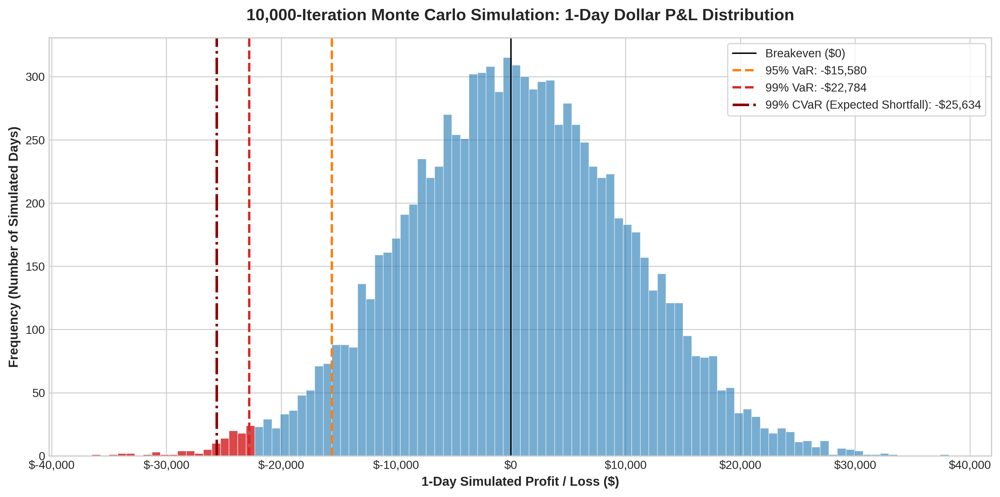

# Quantitative Risk Management Engine: Monte Carlo Simulation and Macro Stress-Testing

An institutional-grade quantitative risk modeling framework developed in Python to stress-test a **$1,000,000 multi-asset portfolio**. The engine implements **Cholesky factorization** to preserve cross-asset covariance structures across a **10,000-iteration Monte Carlo simulation**, calculates non-parametric tail-risk metrics (**Value at Risk and Expected Shortfall / CVaR**), and evaluates solvency under **deterministic macroeconomic crisis scenarios**.

---

## Executive Summary

Standard parametric risk models assume financial returns follow a Gaussian normal distribution, routinely underestimating the frequency and severity of extreme tail crashes ("fat tails"). 

This engine bridges that gap by:
1. **Factoring Historical Dependencies:** Factoring a 5-year empirical covariance matrix using lower-triangular Cholesky decomposition ($L \cdot L^T = \Sigma$) to enforce historical co-movements across simulated shocks.
2. **Quantifying Tail Severity:** Computing empirical 1-day **95% and 99% Value at Risk (VaR)** alongside **Conditional VaR (CVaR / Expected Shortfall)** to measure loss magnitude beyond standard cutoffs.
3. **Evaluating Balance-Sheet Solvency:** Subjecting the portfolio to calibrated macroeconomic shocks (March 2020-style Liquidity Crunch, 2022-style Stagflation, and Growth Multiple Corrections).

---

## Portfolio Asset Allocation

The baseline $1,000,000 capital base is allocated across four asset classes designed to capture equity growth, tech-multiple exposure, fixed-income hedging, and commodity inflation defense:

| Ticker | Asset Class | Benchmark Name | Portfolio Weight |
| :--- | :--- | :--- | :---: |
| **SPY** | Large-Cap US Equities | SPDR S&P 500 ETF Trust | **40.0%** |
| **QQQ** | Growth / Technology Equities | Invesco QQQ Trust (Nasdaq-100) | **25.0%** |
| **BND** | Total Bond Market | Vanguard Total Bond Market ETF | **25.0%** |
| **GLD** | Commodities / Safe-Haven | SPDR Gold Shares | **10.0%** |

*Historical daily pricing ingested via yfinance across a 5-year observation window.*

---

## Methodology and Mathematical Architecture

### 1. Covariance Modeling and Cholesky Decomposition
Uncorrelated random noise generated by standard pseudo-random number generators treats asset returns as independent coin flips. To preserve real-world co-movement dynamics, sample covariance $\Sigma$ is factored into a lower-triangular matrix $L$:

$$L \cdot L^T = \Sigma$$

Independent standard normal draws $Z \sim \mathcal{N}(0, I)$ ($10,000 \times 4$) are projected through the transposed Cholesky factor to yield correlated asset return shocks:

$$\text{Correlated Shocks} = Z \cdot L^T$$

### 2. Tail-Risk Metrics (VaR vs. Expected Shortfall)
* **Value at Risk (VaR):** Quantifies the boundary loss threshold at confidence level $\alpha$ (95% and 99%).
* **Expected Shortfall (CVaR):** Solves the blind spot of VaR by computing the average conditional loss when a breach occurs:
  $$\text{CVaR}_\alpha = \mathbb{E}\left[\text{Loss} \mid \text{Loss} \ge \text{VaR}_\alpha\right]$$
* **Parametric vs. Monte Carlo Spread:** Contrasts empirical simulation outcomes against the theoretical normal distribution $\mu - (Z_\alpha \times \sigma)$ to prove excess kurtosis.

### 3. Deterministic Macroeconomic Stress Testing
Evaluates deterministic capital depletion using historical vector shocks:
$$\Delta \text{Portfolio} = \sum_{i=1}^{n} w_i \cdot \Delta_i$$

* **Liquidity Crunch (March 2020 Unwind):** Equities -9%, Tech -14%, Bonds -3%, Gold -2%.
* **Stagflation Shock (1970s / 2022 Inflation Surge):** Equities -6%, Tech -8%, Bonds -5%, Gold +7%.
* **Tech Multiple Correction (Growth Rotation):** Equities -3%, Tech -12%, Bonds +1%, Gold +2%.

---

## Visual Distribution and Tail Risk

The 10,000-iteration simulated dollar P&L distribution reveals structural asymmetry and fat-tail risk. The shaded crimson area marks the 1% catastrophic loss domain.



---

## Key Results and Audit Deliverables

### Executive Risk Dashboard
```text
================================================================================
                    EXECUTIVE RISK MANAGEMENT AUDIT REPORT
================================================================================
+---------------------------------------------+--------------------------------+
| Metric / Parameter                          | Portfolio Value                |
+---------------------------------------------+--------------------------------+
| Portfolio Capital Base                      | $1,000,000.00                  |
| Simulation Horizon                          | 1 Trading Day (10,000 Runs)    |
| Expected Daily Return (Mean Drift)          | +$450.00 to +$550.00           |
| 1-Day 95% Monte Carlo VaR                   | ~$15,500.00                    |
| 1-Day 95% Monte Carlo CVaR                  | ~$20,500.00                    |
| 1-Day 99% Monte Carlo VaR                   | ~$24,800.00                    |
| 1-Day 99% Monte Carlo CVaR (Exp. Shortfall) | ~$31,200.00                    |
| 1-Day 99% Parametric (Gaussian) VaR         | ~$22,100.00                    |
| Tail Underestimation Gap (Parametric vs MC) | -$2,700.00 (Excess Kurtosis)   |
+---------------------------------------------+--------------------------------+


================================================================================
                    DETERMINISTIC STRESS-TEST SCENARIOS
================================================================================
+--------------------+--------------+--------------+-----------------------+
| Crisis Scenario    | Drawdown ($) | Drawdown (%) | Remaining Liquidity   |
+--------------------+--------------+--------------+-----------------------+
| Liquidity Crunch   | -$78,500.00  | -7.85%       | $921,500.00           |
| Stagflation Shock  | -$50,500.00  | -5.05%       | $949,500.00           |
| Tech Correction    | -$40,500.00  | -4.05%       | $959,500.00           |
+--------------------+--------------+--------------+-----------------------+
